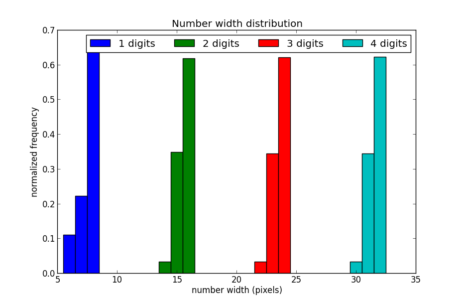

How to (partially) declassify NSA documents
===========================================

The day before Christmas Eve, the (American) NSA published a bunch of
[declassified
reports](https://www.nsa.gov/public_info/declass/IntelligenceOversightBoard.shtml)
that have been handed to the President's Intelligence Oversight Board
(IOD) for the past 10 years or so. I quickly scrolled through a couple
of documents to find a lot of heavily redacted text:

The idea
--------

What struck me was that what most of the redacted text that I think the
public (and me) are interested in is the magnitude of NSA surveillance,
namely how large the redacted numbers are. I started asking myself,
**can the space that the redacted numbers take up on a document tell us
anything about what's redacted behind the white boxes?** I think the
answer is fairly obvious - yes - the number "1000000" definitely does
not fit into most boxes, so we can conclude that targetted surveillance
is less than that. But can we do better?

Before we dig further - how to we know that the content underneath the
redaction boxes are similarly sized as the numbers they redact? We
don't. However, we can always be certain of the width of the number plus
the space to the left and right of it (since it's visible):

In the NSA case, we also know that

-   they are not using justified alignments. This would make spacing
    less deterministic.
-   they don't seem to manually add spacing (or zero pad) around their
    non-redacted numbers.

In information theory Shannon introduced the concept of entropy as a
measure of information. In layman's terms, the more similar data is, the
less information is contains. If we make an analogy to the number width
problem, we are hoping that different numbers in whatever font the NSA
is using should have as unique width as possible.

For non-monospaced fonts, there is the chance of digits being different
in size. Further, there is also a chance that they have different
[kerning](http://en.wikipedia.org/wiki/Kerning), which could make number
width signatures even more unique.

The font
--------

By the way, which font are NSA they using? I gave
[WhatTheFont](https://www.myfonts.com/WhatTheFont/) a try and it hinted
that the NSA is using any of the following fonts:

-   Esperanto Condensed Bold
-   URW Garamonds ExtraNarrow Medium
-   Aragon Condensed
-   Printed Claude.
-   FF Seria Sans Pro Bold Italic

Looking at those fonts, the only one the it could potentially be would
be Garamond, which is a fairly popular font. That said, when overlaying
it with NSA text it didn't match too well. However, a simple guess that
the NSA was using the good 'ole Times New Roman looked like a better
match:

The reason it does not match fully is due to a slight different
[kerning](http://en.wikipedia.org/wiki/Kerning). A quick Googling
brought me to
[this](https://www.libreoffice.org/bugzilla/show_bug.cgi?id=72546) bug
report (are NSA using LibreOffice?). Looks like I was not using the
exact font (or rendered) match.

Test implementation
-------------------

To test my theory I wrote a [small Python
script](https://gist.github.com/JensRantil/7cd230367dbb35027a8a) to
generate histograms of the width of numbers. It uses ImageMagick to
generate test images, crop and output the width of the images.

Output for "Times New Roman" with size 16px:

Output for "Times New Roman" with size 30px:

Result
------

Sadly, the results show that different numbers yield fairly similar
width. It also looks like different font sizes didn't make any
significant difference in length signature.

That said, the number of digits yields a unique width so we can
definitely know the magnitude of the redacted numbers, ie. whether they
are 10s, 100s or 1000s etc.

Discussion
----------

ImageMagick uses the freetype library for font rendering. freetype has
support for kerning, but kerning could definitely differ in
implementation. I had a quick look at scripting MS Word, but it looked
like too much of a hazzle for such a short experiment. Especially on
MaxOSX. LibreOffice has slightly better scripting support. Scripting a
fully featured word processor is definitely a future possible
experiment/improvement.

The font I am using is the "Times new roman" font that comes with
MacOSX. MS Office ships with its own which could have different kerning
and/or different digit widths. This would probably yield a different
result from mine.

For people who are planning to do safe redaction of text in documents,
think about the following:

-   Use a font with preferably no kerning. Monospaced font will do.
-   Use font with same-width digits. Monospaced font will do.
-   To avoid leaking magnitude of numbers, pad all numbers with fixed,
    or random, spaces.

That said, it would be a fun thought experiment if NSA, or other
intelligence organizations, would infiltrate (Times New Roman)
typesetters to create unique kerning for letter constellations. It could
make it much easier to work around redacted text in declassified
documents from around the world. Call it a *typography backdoor* if you
will.

Conclusion
----------

This little experiment tested and showed that it's possible to extract
the magnitude in the redacted numbers in declassified (NSA) documents.
It could not show that digit width or kerning could help in determining
the numbers more specifically. However, there is definitely future
improvements.

If you are curious about the magnitude of the redacted NSA numbers,
consider them leaked. I'll let someone else do the hard work of
extracting them ;-).
