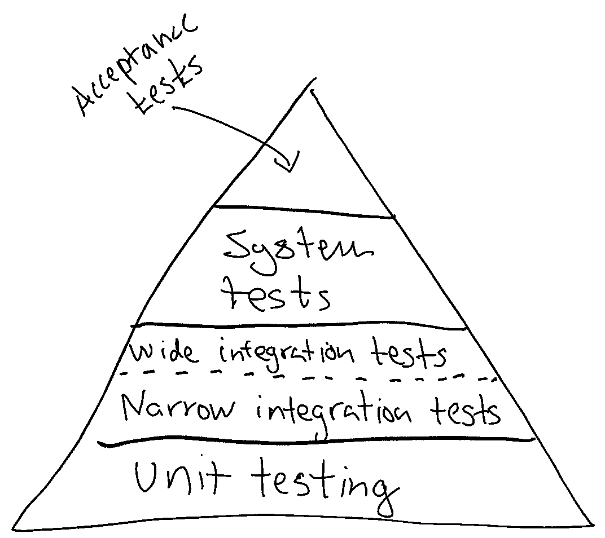
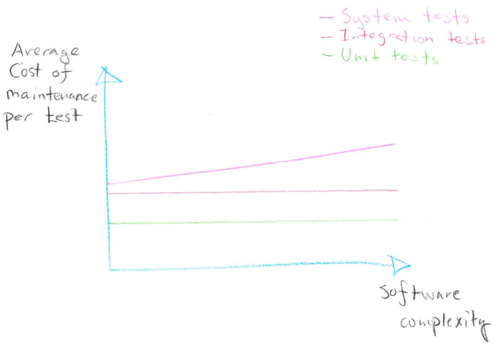
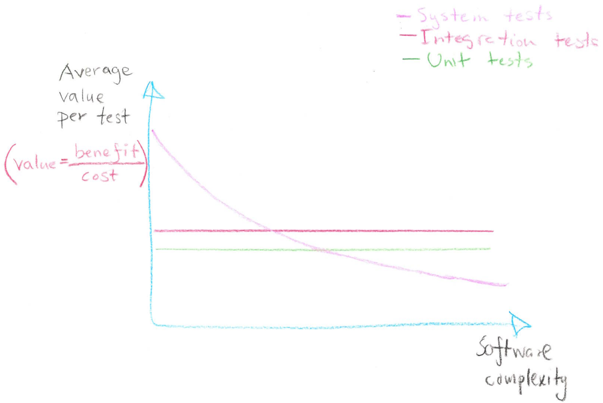

Last year (2019) I spent a fair amount of time thinking about how to grow
[Tink's](https://www.tinkapp.com) technical platform; how to organise ourselves
-- alignment vs. autonomy.  What processes, tooling and policies were needed
for our teams to build amazing, stable, performant things at a fast pace? Tink
had essentially doubled in size yearly for four years and the growth had really
pushed our engineering organisation to the limits. We are now around 150
engineers. We were less than 10 engineers when I started in early 2014.

> What are the foundational building blocks and processes needed for us to have
> twice as many teams in a years time?

The technical platform has grown from a Java monolith consisting of a few
services that mostly were deployed at the same time, to almost 100 polyglot
services (mostly microservices) being deployed continuously by lots of teams.

One thing that really changes once you move towards a microservice architecture
is testing. Large-scale system testing involving many applications, owned by lots of
different teams, becomes increasingly difficult.

As I was thinking about testing strategy, I decided to give a talk at the
[Stockholm Go Meetup](https://www.meetup.com/Go-Stockholm/events/260663183/) on
how we do testing at Tink ([slides](testing-at-tink.pdf)).  Ignoring the fact
that the slides barely were readable (sorry!), my intention was to talk about 1)
the different types of test there are and 2) the different tradeoffs we are
making when choosing different testing strategies. The talk itself came out of
an observation that a lot of developers have strong opinions about testing.
However, we rarely talk about what it's actually trying to achieve, or which
contexts different software can be in.

The talk started with presenting a small variant of the classical test
Pyramid:

A difference between the test pyramid above and the classical test pyramid is
that it distinguishes between "narrow integration tests" and "wide integration
tests". Martin Fowler has written a great
[article](https://martinfowler.com/bliki/IntegrationTest.html) about the
concept of narrow integration tests. I have more to say about that, but I'll
leave that to another blog post!

My presentation then continued making a bunch of small observations about the
pyramid. Namely, the higher up in the pyramid you are, the

 * the fewer tests compared to the base (thus, a Pyramid).
 * the **slower feedback** you will get.
 * the **more brittle** your tests will become as they involve more components.
   This also means they are harder to make stable.
 * **more maintenance is needed** as more components are involved.
 * **harder it becomes to debug** as more components are involved.
 * **slower the tests** tend to be to run as they need to initialize more
   components. System tests might even need to read up data from disk or
   external database to function.
 * **more complex they are to run**. System tests might need configuration to
   run.
 * **closer you are to production**.
 * **higher coverage per test** as each test generally touches more components.
 * **harder it gets to reach higher levels of test coverage**. By this I don't
   mean 100% test coverage is a goal. For a long time at Tink we were rather
   system tests heavy. When we started running the same application across many
   production environment, running our system tests for all combinations of
   configuration became impossible.

Additionally, I also made the observation that tests in the lower part of the
pyramid requires "low coupling and high cohesion" (LCHC), generally considered good
software design practises. That said, it _is_ possible to have low coupling and
high cohesion in an application which are lacking integration and/or unit tests.

The fact that LCHC is required for unit tests and narrow integration tests also
means that [big balls](http://www.laputan.org/mud/) [of
mud](https://en.wikipedia.org/wiki/Big_ball_of_mud) are very hard to test with
such tests. For teams inheriting balls of mud it therefor makes sense to focus
on blackbox system and/or acceptance tests so they can then refactor the
application to allow for smaller tests.

Furthermore, I made an observation how different types of tests' cost changes
as software complexity increases:

The assumption here in the graph is that an "Integration test" depends on a
fixed number of components. Therefor the cost of maintaining such test does not
grow as the software gets more components. This leads to the following benefit/cost
ratio:

My experience over the years is that software complexity tend to grow over
time. New requirements & features tend to be added, fewer removed.
Additionally, rewrites to simplify something are rare. For good reasons! The
risks in doing a rewrite are huge.

This insight is key. I believe it explains why our community is so fragmented
when it comes to testing strategy -- it's because testing _strategy must change
with software complexity_! Engineers who only has experience of low complex
software will argue for investing in a few high-level system or wide integration
tests. Engineers with experience with high complexity, tend to be weary of
such tests and instead prefer unit tests and narrow integration tests.

But the reality is that none of the engineers are right. The distribution of
different test types is not fixed. Instead, it changes over the life of a
software. Initially when developing a tiny microservice, I find a single system
test giving me huge benefits. As my software grows, I implement fewer and fewer
system and wide integration tests -- the become increasingly painful to work
with!

Is there a way to avoid having to change testing strategy over time? Perhaps.
Avoid introducing complexity or make sure your core developers stay around:

With the advent of microservices, some companies have a cultural preferences to
keep their services small. To some extent this can keep complexity down on the
service level. However, it's worth remembering that it pushes complexity on the
platform architecture level; for example, investments in observability becomes
increasingly important.

To some extent you can also avoid hitting the costs of software complexity by
making sure you keep core competencies about an application around. Training
can also, to some extent, help. That said, you are playing a rather risky game
here as developers will eventually come and go. Eventually complexity will come
back biting you in the back.
