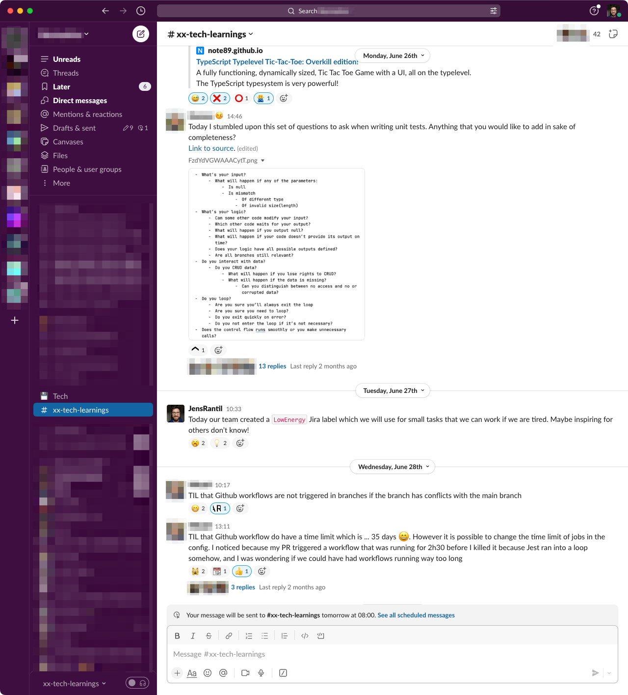

+++ 
date = 2023-08-29T18:03:46+02:00
title = "Tools for innovation in tech"
description = "A list of some tools that can be used to foster innovation within tech organizations."
tags = ["organization"]
slug = "tools-for-innovation-in-tech"
+++
As a tech organization, how do you deal with making sure you innovate? In my
opinion, innovation doesn't "just happen". While the dream scenario is that any
engineers can propose an idea to work on within their team sprint, I have seen
multiple reasons why this fails such as:

 * **"There is no time for that."** Teams working under urgent conditions might
   constantly down-priorize trying out new things.
 * **"Could you explain why we need to do that?"** This is a common question you
   might get if the stakeholder is choosing what you should work on during your
   sprint. Sometimes innovation comes from crazy projects that are hard to argue for.
 * The **team might lack psychological safety** to allow for ideas to bubble
   up.
 * **Planning for innovation kills innovation.** This is a big one for me. I
   just don't feel as creative if I need to explicitly ask for permission and
   plan for innovation. I am the most innovative when I sometimes
   stumble across a small problem and immediately can spend time finding a
   solution.

So, if innovation is hard to get into the regular planning with the team, how
can we increase innovation? Here are some tools that I have seen successfully
deployed to help with this:

## The "three-bucket model" for individuals

I've previously written about the ["three buckets model" for
individuals][individual-bucket-model]. By making it explicit that there is a
"me bucket", I have implicitly allowed myself and others to take the time to
try out something without having to ask for permission.

[individual-bucket-model]: 

## The three categories of work for teams

I've previously written about the ["three categories of
work"][team-bucket-model] a team can have. Explicitly asking about "Team
initiatives" helps the team to start thinking about improvements they can make.
It also signals that innovation is _not_ someone else's job, but everyone's job
- including engineers.

[team-bucket-model]: 

## Hackathons

[Hackathons][hackathon] are usually larger events where an entire department
come together to build something rapidly and collaboratively. People form teams
of ~2-5 people and work on a project of their choosing. The hackathons I've
taken part in lasted for at least two days. Usually, the hackathon ends with an
event where all the hack projects built are presented. The only rule is that
all teams need to present what they built so far during the hackathon at the
end.

An optional additional rule you can have for a hackathon is that everyone must
team up with at least one person from another team. I have seen firsthand
that this is a great way to foster cross-team collaboration and connection
building.

[hackathon]: https://en.wikipedia.org/wiki/Hackathon

Some of the hackathons I have taken part in have competitions involving prices
for various categories. Of course, you can have fun prices such as "the cutest
innovation" or "the funniest hack". However, I am generally hesitant to
introduce themed prices for innovations as it adds constraints to the projects
people take on. I have seen some remarkable things come out of hackathons - and
it's usually never the improvements I was expecting (new deployment tools,
scripts to debug more easily, a brand new product feature). Adding constraints
can harm the outcome. You _can_ have themed hackathons, though. They are useful
if you would like to innovate on a specific topic.

Hackathons can also be had across an entire company. This is cool!  Imagine all
the helping hand an engineer could give the legal, HR, or marketing department.
I have heard of lots of process improvements; Create a website for hiring? Or
help the legal department search through contracts faster? Or configure Google
Analytics to [help](help) the marketing department understand visitors better?

## Hack days

Hack days are micro hackathons, but on a smaller team basis on a regular
cadence. Usually, a hack day happens at least once per month, but I used to work
in a team where we had one every two weeks. Similarly to hack days, the only
rule was that you presented what you had done for the day.

The outcomes from our hack days included everything from "fixing that bug you
[never](never) got to" to "trying out a new programming library to learn something new".

I have also seen variations where hack days are incorporated as part of the
larger ritual of a team. I have heard of teams doing a hack day at the beginning
of a sprint. Basecamp's [Shape Up][shape-up] has a ["cool down"
period][su-cool-down] at the end of each cycle which also can be used for this.

[shape-up]: https://basecamp.com/shapeup
[su-cool-down]: https://basecamp.com/shapeup/3.6-chapter-15#let-the-storm-pass

## Tech Show'n'tell

Tech Show'n'tell, also known as _Tech Demos_, is a place where engineers come
together to celebrate innovation. They are regular events where engineers and
teams share what they have built, tried, or learned:

**Built** could be everything from a small tool, a proof of concept, or a fully
functioning product feature.

**Tried** can be things like experiments, but also team processes or tools.
Maybe a team is trying out mob programming and would like to share their
learnings with the rest of the organization? Or maybe a team discovered a new
wiki SaaS they are trying out. Tech Show'n'tells are not just for techie things
built by teams.

**Learned** can be things things someone learned by reading a book or a blog
post. Maybe someone learned [the different types of test doubles][test-double]?
Or someone did do some research around testing frameworks and wanted to share
their learnings?

[test-double]: https://martinfowler.com/bliki/TestDouble.html

## Create a knowledge-sharing water hole

Innovation happens easier if you create an environment where ideas and
knowledge can flow. I love creating "water holes" - places where water cooler
conversations can be had around certain topics. A `#knowledge-sharing` chat
room (Slack channel, etc.) can be a surprisingly simple way to increase
knowledge sharing.

## Reducing processes

Finally, removing rigid processes can be a great way to create innovation.  If
you [prefer toolkits over rigid processes][toolkits-not-processes] you increase
the likelihood of engineers naturally coming up with better processes or
finding better tools to do the work they need to do. Remember that it is
usually the builders (your engineers) who know which tools and processes they
need to have in place to do their job best.

[toolkits-not-processes]: https://betterprogramming.pub/process-that-empowers-32cd86e1d9ad

# Closing thought

Innovation is not just something that "happens". It is something that you
actively need to create spaces for if you want to take it seriously. I hope you
and your team will find any of these tools useful or inspiring.
