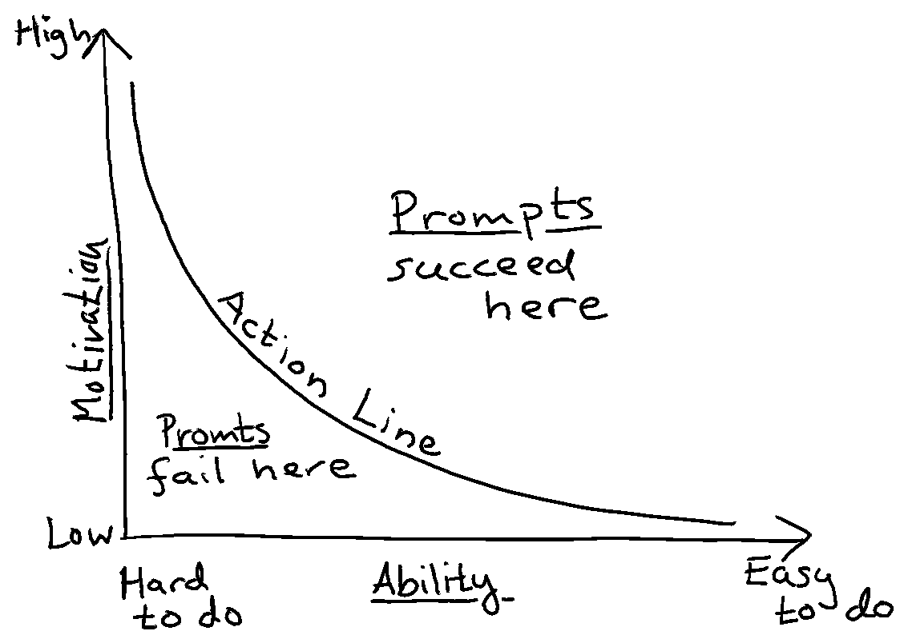

+++ 
date = 2023-09-04T22:38:33+02:00
title = "A model for changing behaviors"
description = "I have found the Fogg Behavior Model to be a great tool when brainstorming how to change the behavior of other people or myself."
slug = "a-model-for-changing-behaviors"
+++
As you progress more into an engineering leadership role, you not only work with technical
solutions, but you also need to drive change. And change usually involves
changing the behavior of people. You might start to notice that

> Tech is not actually the hardest of problems, humans are.

For example, let's say that you want your engineers to start writing more unit tests in their day-to-day work. Setting up your programming language's common unit test library usually isn't that hard. But where it gets tricky is how you _actually_ make engineers start writing those tests. For problems like this, I have found the Fogg Behavior Model very useful.

## The Fogg Behavior Model

The [Fogg Behavior Model][fogg] is a model developed by Dr. BJ Fogg. It's a model that helps us to understand the behavior of people, such as performing a specific task. It is also a model that can be used to come up with ways to _change_ behavior.

[fogg]: https://behaviormodel.org

The model states that there are three core pieces to a behavior:

 * A **motivation** to perform the task. The higher the motivation, the more likely it is for the behavior to happen.
 * An **ability** to perform the behavior or task. The easier it is, the more likely it is for the behavior to happen.
 * A **prompt** that triggers the behavior to kick in.

Ability and motivation interrelate - and that's what the "Action Line" shows in the above graph.

If you have a really low motivation, making it really easy to perform the task can compensate for that. For example, if my running shoes (and clothes!) are neatly piled up next to my bed (high ability) when I wake up, I might need less motivation to go out running.

Similarly, if you have really high motivation, you can accept a lower ability. If I am really motivated to go running one morning, I am willing to spend five minutes looking for my running shoes (low ability).

## "Why don't they write those unit tests???"

Let's go back to my previous example where we wanted our engineers to write more unit tests. Whenever I've faced a problem like that, I start asking myself whether I can move the needle on any of Motivation, Ability, or Prompt. I have found the Fogg model very useful when brainstorming how to change behavior. Let's see what we can come up with:

Motivation:

 * We can show how fun it can be to write unit tests.
 * We can show how much fewer bugs they will need to deal with if they write unit tests.
 * We can write out weekly stats in our team Slack channel for "who wrote the most tests".
 * We can publish our test coverage on a weekly basis.
 * We can point to developers who write good unit tests as raw models for everyone else.
 * ...

Ability:

 * We can obviously set up the test suite such that it is _really_ easy to run the tests.
 * We can do training on how to write good unit tests. Not all engineers are familiar with a healthy unit testing culture!
 * We can make the tests execute much faster.
 * We can create a scaffolding tool that makes it a breeze to write
 * We can set up tooling making it really easy to work with example customer data.
 * ...

Prompt:

 * Every Github pull request can report how test coverage changes. This will definitely remind people to write unit tests.
 * Every pull request could have a checklist that includes "Write unit tests for what you are changing".
 * Pull request reviewers could ask for unit tests when reviewing code.
 * ...

Once, I have listed all these ideas, I usually map each item up in an [Impact-Effort matrix][impact-effort] and prioritize what to work on from there.

[impact-effort]: https://monday.com/blog/project-management/impact-effort-matrix/

## A tool for brainstorming

As you can see, the Fogg Behavior Model can be really useful when brainstorming how to change people's behavior. I hope it can be a useful tool for you. It certainly has been for me, both in my professional life, as well as personally.
