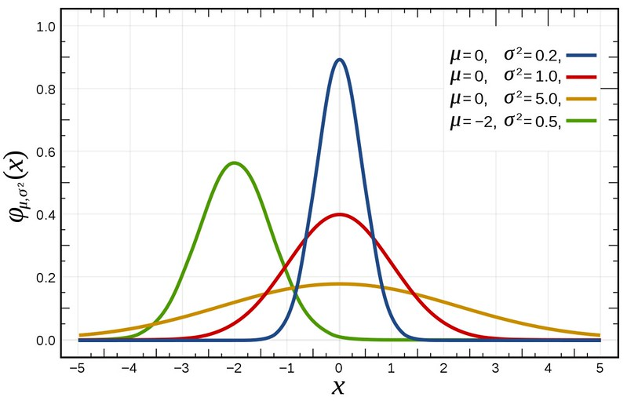
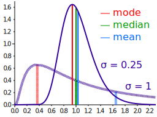

+++ 
date = 2023-10-03T22:22:35+02:00
title = "Mean vs. median"
description = "The median bell curve is mean."
slug = "mean-vs-median"
tags = ["statistics"]
+++
Over the years, I have heard many people say something like

> Over 50% of people think they are better than the average car driver.

They say this as if it's funny and sounds smart. But the irony of it is that it
actually could be true. Why? Because _mean and median are not the same
thing_.

When people are taking a course in statistics they tend to come out of it
thinking that the world mostly consists of normal distributions. Given the
[Central Limit Theorem][clt], a lot of focus in Statistics 101 tends to focus on
the normal distribution. This means students leave having a visual
representation of a statistical distribution as a bell curve. I believe this
has created a lot of confusion.

[clt]: https://en.wikipedia.org/wiki/Central_limit_theorem

A big problem with thinking that all statistical distributions look like a bell
curve is that it is symmetric along an a vertical axis, the mean. This means
that for a bell curve, the mean and median (or 50th percentile) are identical.
In layman's speak, 50% of the curve's area is to the left (or to the right) of
the mean. In the world of statistical distributions, this is an extreme
outlier.

Most distributions do _not_ have the same mean and median. See for example the
following log-normal distributions where the blue and green lines do _not_
coincide:

(Log-normal distribution. (2023, October 2). In Wikipedia. https://en.wikipedia.org/wiki/Log-normal_distribution)

In the world of software, it can be very important to understand that
percentiles (a median is the 50th percentile, remember?) can be significantly
different from the mean. For example, [latencies are rarely distributed
according to a normal distribution][latency-perc]. This means that while the
average latency can look very promising, it still has significant outliers
that kill the user experience.

[latency-perc]: https://www.linkedin.com/pulse/why-percentile-preferred-over-average-latency-kedar-kamthe/

The only time when averages for latency is useful is when talking about
throughput. More on that in another article.
