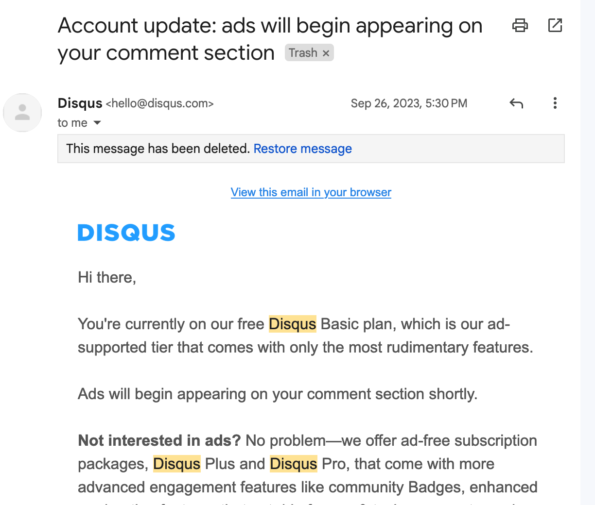
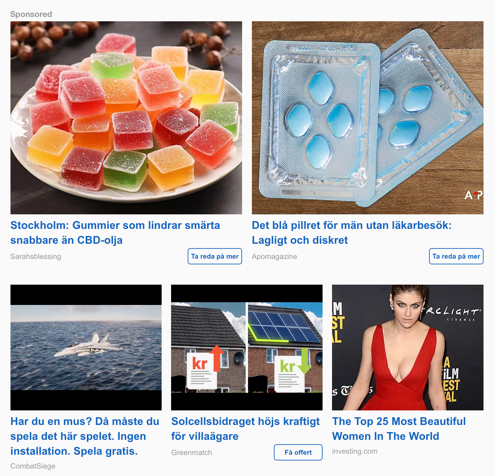
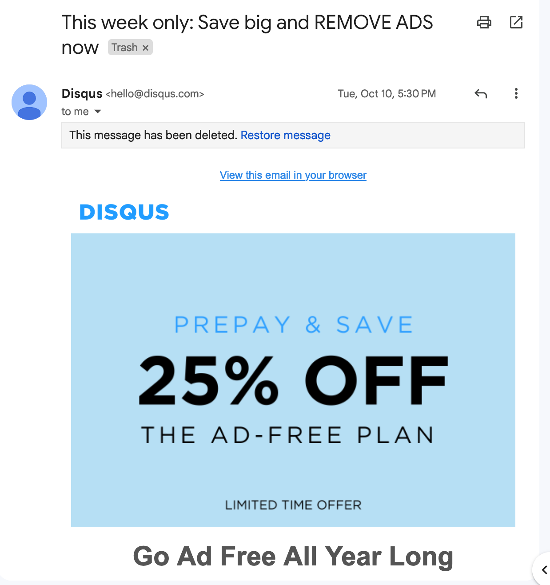

+++ 
date = 2023-10-31T20:47:35+02:00
title = "Goodbye Disqus"
description = "Holding users hostage is not something I want to support."
tags = []
slug = "goodbye-disqus"
+++



I just disabled blog post commenting on this blog after [Disqus][disqus], my
former blog post comment system, rolled out a pretty horrible (or shall I
say...disqusting?) change. 

[disqus]: https://disqus.com

On the 26th of September, Disqus decided to introduce ads without any sort of
warning. And it wasn't just any kind of ads:

Suddenly I started seeing high-quality ads...NOT...recommending me to look at
25 beautiful videos, buy solar panels, and possibly drugs.

On top of this, they soon sent me an offer to get a discounted price:

Modern hostage situation!
 
Given that very few of my posts receive any kind of comments these days, I
don't have any intention of reenabling comments for now. If you truly think I
need comments, reach out, and I can make an effort to enable some commenting
system. You can find [my contact information on this site's
front page][reach-out].

[reach-out]: 
