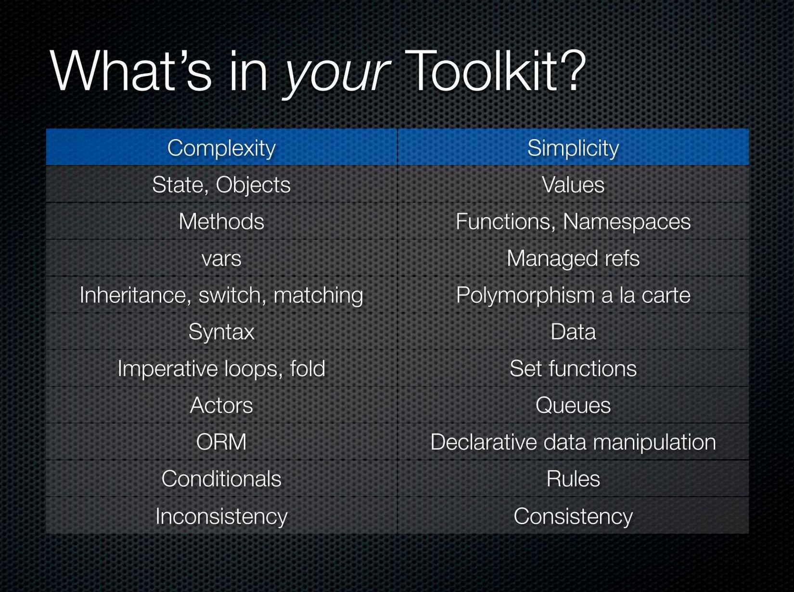

+++ 
date = 2023-11-06T19:45:35+02:00
title = "My simplicity toolkit"
description = "Simple vs. easy - and an intro to my simplicity toolbox."
tags = ["simplicity"]
categories = ["My Simplicity Toolkit"]
slug = "my-simplicity-toolkit"
+++

> “Perfection is Achieved Not When There Is Nothing More to Add, But When There
> Is Nothing Left to Take Away”
>
> Antoine de Saint-Exupery

When it comes to software engineers, I'm a sucker for simplicity and going back
to basics. I have been coding for ~25+ years (~15 years professionally) and
have truly gone through [The Evolution of a Software
Engineer][engineer-evolution]. Throughout my career I have grown increasingly
worried about the growing [cargo culted][cargo-cult] complexity in our
industry.

[engineer-evolution]: https://medium.com/@webseanhickey/the-evolution-of-a-software-engineer-db854689243
[cargo-cult]: https://en.wikipedia.org/wiki/Cargo_cult_programming

In Rich Hickey's classical talk ["Simple Made Easy"][simple-made-easy] he talks
about the difference between "Simple" and "Easy". _Simple_ pertains to the lack
of complexity or intricacy, while _easy_ relates to the level of effort or
skill required to accomplish a task. Hickey argues that we, as software
engineers, should choose simple over easy, but often end up doing the opposite.

[simple-made-easy]: https://www.youtube.com/watch?v=SxdOUGdseq4

## Simplicity is controversial

As Hickey points out,

> Simplicity is a choice.

and these days I would even say it is controversial. For example, I am a sucker
for, focusing on simple programming language constructs, doing _simple_
dependency injection without any dependency injection framework/library,
focusing on simple libraries over frameworks, avoiding complex/complicated
build tooling, quick compile times, smaller scoped tests, smaller interfaces,
not needing microservices by default, [not needing SPAs by default][no-spa], [avoiding as
many moving parts as possible][rad-simplicity] etc. Also, a focus on backward
compatibility and a preference towards [not using the latest and coolest
tech][boring-tech].

[no-spa]: https://www.thoughtworks.com/radar/techniques/spa-by-default

Further, I am a sucker for simple solutions programming-wise; Boring code is
good code. This is mainly why I have had a growing fondness for [the Go
programming language][golang] for the past few years.

[rad-simplicity]: https://www.radicalsimpli.city
[boring-tech]: https://boringtechnology.club
[golang]: https://go.dev

## A note on pragmatism

Choosing X over Y is about preference, not a rule. I think the software we are
building should have the same level of complexity as the business problems we
are solving; By focusing on simplicity first, we work with simple constructs
allowing us to gradually introduce complexity into our software.

I am sure there are cases where larger interfaces are needed, where Kubernetes
is a good platform to use instead of a managed service, etc. IMO, it just
should not be our go-to solutions.

## My Simplicity Toolkit

There are many nuggets in Hickey's talk, but one of my favorites is the slide
where he talks about his "simplicity toolkit":

The thing I liked about the slide was how it made everything so much
more concrete. Which solution to prefer _over another_. If I would ask anyone
"Would you prefer simplicity?" I am sure most people would say "yes". But by
showing that simplicity is a choice, a stand against something, you force
people to make a decision away from [complecting][complect] things.

[complect]: https://youtu.be/SxdOUGdseq4?si=AYiDh-n_KMwCLwl4&t=1895

In the next few blog posts, I would like to share some of _my_ simplicity
toolkit. Many of these preferences are the result of banging my head against
the keyboard for days and nights and eventually realizing I did not need all
this complexity.

You will some of these preferences written down in [my Quora post][quora] which
I used to curate for many years. Others are more recent insights. I hope you
will enjoy my posts - and if I manage to challenge you to simplify the software
you are building, even better!

[quora]: https://www.quora.com/What-are-the-best-secrets-of-great-programmers/answer/Jens-Rantil

_This was the intro to my blog post series about my simplicity toolkit. You can find my first toolkit post [here][next-toolkit-post]._

[next-toolkit-post]: 
