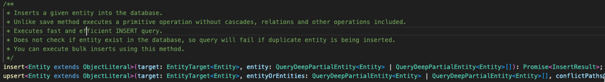

+++ 
date = 2023-11-07T07:45:35+02:00
title = "My simplicity toolkit: Programming (part 1)"
description = "Simple software programming preferences in my simplicity toolbox."
tags = ["simplicity"]
categories = ["My Simplicity Toolkit"]
slug = "programming-simplicity"
+++
**This post is part of of my blog series about [_My Simplicity
Toolkit_][simpl-toolkit]. I suggest you read [the initial
post][simpl-toolkit-init] before reading this post.**

[simpl-toolkit]: 
[simpl-toolkit-init]: 

As engineers it is our duty to constantly battle complexity to be able to ship
at a sustainable pace. This is particularly important when writing code. This
post is a list of things that I have helped keep the source code I am working
in simple.

## Composition over inheritance

If you are coding any sort of object-oriented programming language it most
likely supports class inheritance. A lot of people have gone before me and
[written great blog posts about why inheritance is a bad
idea][avoid-inheritance] so I will simply refer to those.

Above said, after having been programming professionally in Java for over 10
years, I have only found _one_ case where inheritance should be used, and that
is if a third party library takes a `class` as a parameter instead of an
`interface`. That's it. All other cases should use composition and Java
interfaces.

[avoid-inheritance]: https://neethack.com/2017/04/Why-inheritance-is-bad/

## Short-lived mutable state over long-lived

Turns out I have already written about this even before I knew about simple vs.
easy! In 2013, I wrote [I'm a State Engineer. Are you, too?][state-engineer].
It talks about how trying to hold as little mutable state in your head as you
possibly can.

[state-engineer]: 

## Startup over runtime

[I'm a State Engineer. Are you, too?][state-engineer] also talked about
prefering doing more things at startup than at runtime. The more complexity
that can be done at startup than after my HTTP service is in service, the less
likely bugs will happen when servicing requests. I happily crash my application
on startup before it is in service.

For example, if I can read up some small data from the database and store it as
an in-memory immutable object for the rest of the application, I prefer that
over having to read from the database on every API call.

## Side-effect free code over side-effects

Functions, or methods, depending on external state other than their input
parameters are called to have ["side-effects"][side-effects]. For example, a
function depending on an external database is an example of something that has
side-effects; the function will behaving differently depending on what is in
the database.

Side-effect free code is really nice as it makes it very explicit what
(parameters) will alter the behaviour of the code, and I try to isolate as much
as possible of my side-effect free code from the part that has side-effects.
This makes it easy to understand, easy to write unit tests for, and has few
surprises.

I want to make a specific callout to [the Repository pattern][repo-pattern]
here. It is the most underused pattern that can have a huge impact on testing
and code structure. By stuffing all your side-effecty access to data in a
database within a repository implementation, you can easily implement an
in-memory repository. By doing so, _all your business logic can be tested using
an in-memory implementation - and those unit tests will be able to run within a
second_. It also means that your business logic isn't sprinkled with low-level
database logic such as SQL queries.

[side-effects]: https://en.wikipedia.org/wiki/Side_effect_(computer_science)
[repo-pattern]: https://www.linkedin.com/pulse/what-repository-pattern-alper-sara%C3%A7/

See [Functional Core, Imperative Shell][fcis] for more on this.

[fcis]: https://www.destroyallsoftware.com/screencasts/catalog/functional-core-imperative-shell

## Libraries over frameworks

Most "frameworks" are, by definition, a lot of functionalities
[complected][complect] together. This means it's usually hard, or hacky, to
disentangle them, use subset of its functionalities, or replace certain parts
of the framework with another library. Finding frameworks which exists as a set
of smaller set of opinionated libraries is rare.

[complect]: https://youtu.be/SxdOUGdseq4?si=AYiDh-n_KMwCLwl4&t=1895

If you have seriously maintained a framework-heavy source code, you know that
the weight of your framework grows heavier and heavier the more you have
invested in it; upgrading it becomes a nightmare, and replacing it if
maintainers step down is every worse. By instead of using a set of smaller
libraries, it gets easier to replace/upgrade your application pieces one piece
at a time.

A common argument for frameworks is that they are quick get started with. This
is true! But that optimises on _easy_ over simple. Understanding how it works
is usually harder, drilling into its source code is commonly overwhelming, and
it comes with a lot of things [You Ain't Gonna Need][yagni]

[yagni]: https://en.wikipedia.org/wiki/You_aren%27t_gonna_need_it

Another problem with frameworks is that their complexity is binary, not
gradual. When using libraries, you can start simple and gradually build up your
application to the complexity to the level of your business domain's
complexity, not more.

## Simple programming languages over expressive



This also includes simpler type systems over complex ones. Looking at you,
TypeScript! Hello, Java! I am not sure how many of you have spent a day or two
trying to get Java generics to compile? You fix one type, maybe trying to
figure out if you need to use the `extends` or `super` keyword, and suddently
you have a completely different compilation error in another part of your
source code. After a day of fixing compilation errors, you realise you have
been going in circles..qq

This is why I have found [the Go programming language][golang] so refreshing.
It trades verbosity over expressiveness, as a feature. Sure, I need to write
more code, but I at least understand what it does when I read it. This is
particularly important since _the majority of our time as programmers is spent
**reading** code_.

[golang]: https://go.dev

Simple programming language also [compile much faster][compile-times]. I am still surprised
why there aren't more developers picking their programming language based on
that.

[compile-times]: https://programming-language-benchmarks.vercel.app/problem/http-server

[][xkcd-compile]

[xkcd-compile]: https://xkcd.com/303/

## Basic dependency injection (DI) over a DI framework

I have recently met new young programmers who did not know that you can do
dependency injection without a library or framework. You can!

```typescript
class ServiceA {
  doSomething() {
    console.log('Doing something');
  }
}

class ServiceB {
  constructor(private serviceA: ServiceA) {}

  doSomethingElse() {
    this.serviceA.doSomething();
    console.log('Doing something else');
  }
}

const serviceA = new ServiceA();
const serviceB = new ServiceB(serviceA);
serviceB.doSomethingElse();
```
In the example code above, `ServiceB` depends on `ServiceA`. By doing "manual"
dependency injection instead of using an IoC container library, I can

 * understand the order of how objects are created and easily find where my
   application's entrypoint is.
 * read Boringly Simple Code:tm: to understand which objects are
   [singletons][singleton-pattern] and which ones are one-off instances.
 * use my IDE of choice to understand where in my source code
   * my constructor is called.
   * which constructors are called/used.
   * which classes are used.

Simplicity is less magic.

[singleton-pattern]: https://en.wikipedia.org/wiki/Singleton_pattern

## Simple build tooling over complex

Did you ever learn the build tooling you use today at university? Did you learn
how to use _any_ build tool at university? The build tools we are, and have
been using, in our industry is very complex with heavy documentation, and are
usually slow to execute.

Have you ever worked with Java's [Apache Ant][ant], [Apache Maven][maven], or
[Gradle][gradle]? Or [GNU's Autoconf][autoconf]? It takes more time to learn
your equivalent programming language than to master the build tool! Ant is
basically a programming language in XML, and Maven similarly with opinionated
build stages that _never_ matches your business requirements. Autoconf is sort
like a meta-build system that generates you build system.

[maven]: https://maven.apache.org/
[gradle]: https://gradle.org/
[autoconf]: https://www.gnu.org/software/autoconf/

On the more modern end of things we have build tools like [Google's
Bazel][bazel] (et al.), and [nx][nx]; Build systems which are optimised for
building giant software projects (of which you then have yet another problem).

[bazel]: https://bazel.build/
[nx]: https://nx.dev

For Go, I prefer using the `go` tool. For JS/TypeScript, I prefer `npm`. For
Java, I guess I will have to go with...Gradle? :sweat_smile:

## Conclusion

These are some of the tools I use to keep complexity low when writing code.
There is more, but I will leave that for a future post!
