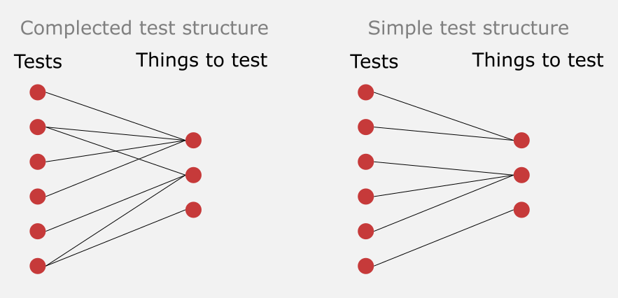

+++ 
date = 2024-02-18T09:45:35+02:00
title = "My simplicity toolkit: Testing"
description = "Ways to keep your tests simple when programming."
tags = ["simplicity", "testing"]
categories = ["My Simplicity Toolkit"]
slug = "software-testing-simplicity"
+++

This post is part of my blog series about [_My Simplicity
Toolkit_][simpl-toolkit]. I highly suggest you read [the introductory post][simpl-toolkit-init] before reading this one.

[simpl-toolkit]: 
[simpl-toolkit-init]: 


In [my initial post][simpl-toolkit-init] on this blog post series I wrote about
the verb ["to complect"][complect]. It means to braid something together. In
this article, I am giving examples of things related to testing that tend to be
unnecessarily complected together.

[complect]: https://www.youtube.com/watch?si=AYiDh-n_KMwCLwl4&t=1895&v=SxdOUGdseq4&feature=youtu.be

Building up a suite of maintainable tests is all about trying to avoid
complecting things unless truly necessary. Notice that complecting things
_is_ necessary at times, just not always.

Tests are naturally complected with the implementation it is trying to verify.
If an implementation is broken, tests will, by design, (hopefully!) break.
However, all developers have a choice of how large of an implementation surface
a test should cover. Have a look at this figure:



Depending on which level of coupling between tests and implementation a
developer takes, you have vastly different levels of complexity. On the left
side, changing an implementation will cause a lot of tests to break. [Changing
an implementation becomes slower and slower][simplicity-google] as you add more
tests. They will all need to be updated! If you instead take the route of the
right part of the figure, you will have a constant set of tests that will need
to be updated over time. My previous articles ["Testing strategy over
time"][testing-over-time] & ["On narrow integration tests"][integrated-testing]
talks about this at length.

[testing-over-time]: 
[simplicity-google]: https://commandcenter.blogspot.com/2023/12/simplicity.html
[integrated-testing]: 
[simpl-toolkit-init]: 

The following is a list of things I keep in my simplicity toolkit when it comes
to testing:

## Test outcome over implementation

In my introduction above I spoke about the cost of updating tests every time I
modify an implementation. It has a high cost.

To reduce the likelihood of that happening, tests should verify _what_
(outcome) is being done in an implementation, not _how_ it's being done. In
other words, your tests should not depend on the inner nitty-gritty details of
an implementation. A different way of looking at it is that a rewrite of how a
class or a function does something shouldn't require changing any of the tests
as long as the outcome is the same. This will make refactoring a lot easier.

### Other test doubles over mocks

[According to Martin Fowler][test-double], a "test double" is
 
> [...] a generic term for any case where you replace a production object for
> testing purposes.

Mocks, spies, fakes, stubs, and dummies are all examples of test doubles.

Fowler further defines a Mock as

> [...] pre-programmed with expectations which form a specification of the
> calls they are expected to receive.

As already stated in the previous section, tests should be coupled to outcome,
not implementation. Mocks tend to be horrible when it comes to this. You send
in an object into your implementation and it's preprogrammed exactly how it
should behave depending on the implementation. I think [Ian Cooper explains it
quite well here][ian-cooper].

[test-double]: https://martinfowler.com/bliki/TestDouble.html
[ian-cooper]: https://youtu.be/EZ05e7EMOLM?si=8hI8sZ-8ZYmyB7I8&t=533

Another problem with mocks is that they tend to be quite complex to use. I
programmed professionally in Java for many many years and still had to look up
things in the reference documentation for [Mockito][mockito]. Other types of
test doubles tend to be much simpler to use and understand.

[mockito]: https://site.mockito.org/

Strictly speaking, I only see two use cases for mocks:

 * If I am coding in a strictly typed programming language, and I am using a
   third-party library that does not adhere to the [dependency inversion
   principle][dip]. Ie., it doesn't have interfaces that I can implement to
   change its internal behavior of it.
 * Certain hackery when it comes to third-party libraries that use `static`s
   and [singletons][singleton].

[dip]: https://en.wikipedia.org/wiki/Dependency_inversion_principle
[singleton]: https://refactoring.guru/design-patterns/singleton

I avoid mocks as much as I can. I guess that makes me [a classicist tester][classicist].

[classicist]: https://martinfowler.com/articles/mocksArentStubs.html

## Given/When/Then over unclarity what is being tested

A common structure for automated tests is to split them up in three stages,
["Given, When, Then"][given-when-then] or ["Arrange, Act,
Assert"][arrange-act-assert] (two variants of the same thing). Here is an
example:

```python
def my_test():
  # Given two numbers:
  a = random_number()
  b = random_number()
  
  # When I call the sum function:
  c = sum([a, b])
  
  # Then the result should be the sum of the numbers
  assert c == a + b
```
Compare the above test to this:
```python
def my_test():
  a = random_number()
  b = random_number()
  c = sum([a, b])
  assert c == a + b
```
The latter example makes it unclear what it is trying to test; Are we checking
if the results return from `random_number()` can be summed? Or are we checking
that the behavior of `sum(...)` behaves as we expect?

> "I don't dare to remove this test, because it might be testing something
> there isn't a test for elsewhere."

If we don't clarify what we are testing (When or Act), developers don't dare to
remove tests over time. Suddenly we have a large evergrowing test suite -
complecting our tests with implementation more and more. You end up having to
update tons of tests every time you make a change to an implementation.

The above problem can be a huge headache in larger code bases.

[given-when-then]: https://martinfowler.com/bliki/GivenWhenThen.html
[arrange-act-assert]: https://java-design-patterns.com/patterns/arrange-act-assert/

### Naming test by outcome over how

Related to the above, it's important to _name_ your tests for the behavior
they are testing, not how it is being done. This includes mentioning the
expected outcome. For my example tests above,
`testThatTwoRandomNumbersSumUpCorrectly` is a much better name that
`testThatSumLoopingWorks`. That the `sum(...)` function uses a loop internally
is irrelevant. And "works" says nothing of the expected outcome.

[This article][tests-naming] looks to be a good one when it comes to the naming of
tests if you would like to know more.

[tests-naming]: https://osherove.com/blog/2005/4/3/naming-standards-for-unit-tests.html

## Unit tests over integration tests

An integration test is a test that, by definition, tests multiple units
together. Compare that to a unit test which by definition only tests a single
unit. This means, by definition, that _an integration test_ complects with more
parts of your implementation.

My article ["Testing Strategy Over Time"][testing-over-time] talked about this
at length.

This practice aligns very well with the classical [Testing
Pyramid][testing-pyramid].

## Narrow integration tests over (general) integration tests

...and if I write an integration test, I make it narrow. _Narrow_ in this case
means that to test an integrated set of units, I test how they integrate and
work with each other pairwise. If they all work well with each other pairwise
(narrow integration test), there is no need to test them altogether (wide
integration test).

For example, I test that two layers in my application interact the way they
should, instead of testing all layers together. This means, that I don't need
an actual database to test the HTTP controller layer. Instead, I make sure that
the HTTP layer delegates calls properly to the business/service layer, etc.

My article ["On narrow integration tests"][integrated-testing] talked about
this at length.

## Testing in production over end-to-end tests


Controversial!


Tests are in a way a liability. There is a cost to maintaining them. The wider
the integration tests, the higher the cost over time. The widest possible
integration tests, and thus the most expensive to maintain, is an end-to-end
test. It is a test that starts up your entire application, needing all your
supporting infrastructure in place (databases, queues, caches...), to be able
to run.

The most realistic test is the one when a user tests any functionality. Nothing
can beat it. Users will double click on the buttons you've only clicked once,
and they will enter 1000 characters in the text field you entered 10
characters.

While, having an automated test that makes sure you application can start _can_
be useful, getting it out in production to test with actual users has the
benefit of getting feedback quicker and not slowing down your development with
[complex, slow, and brittle tests][testing-over-time].

Don't get me wrong, though! To be able to test in production you need a good
foundation:

 * Quick deploys.
 * A solid CI/CD system that can do a gradual rollout.
 * A feature flag system to toggle new features for a subset of users.
 * Solid observability in place to understand the success rate for user
   behaviours.

## References

 * [YouTube - 🚀 TDD, Where Did It All Go Wrong (Ian Cooper)](https://www.youtube.com/watch?v=EZ05e7EMOLM)
 * Matt Schellhas's [Six Minute Guide to Useful Unit Tests](https://matt-schellhas.medium.com/the-five-minute-guide-to-useful-unit-tests-5f675eff01be)

[testing-pyramid]: https://martinfowler.com/bliki/TestPyramid.html
