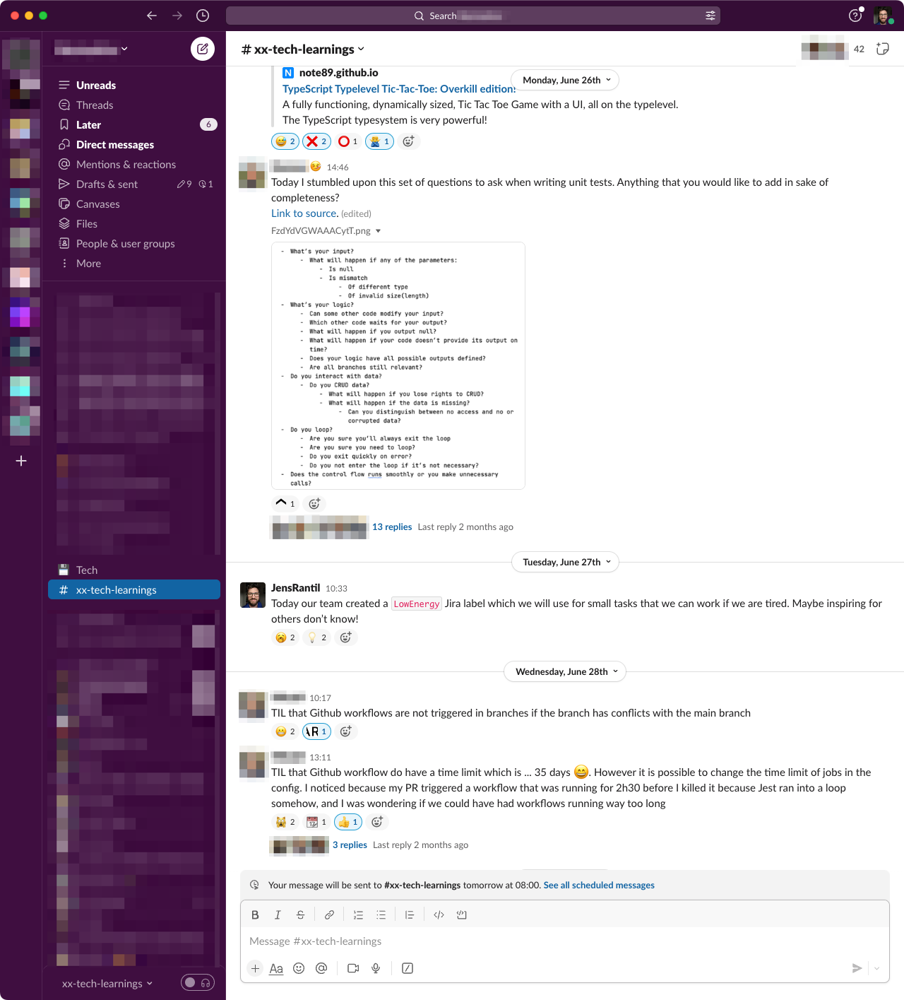

+++ 
date = 2024-05-28T10:57:46+02:00
title = "Tools for innovation in tech"
description = "A list of some tools that can be used to foster innovation within tech organizations."
tags = ["organization"]
slug = "tools-for-innovation-in-tech"
+++
Innovation is the skill of going from idea to action. If innovation is low,
ideas risk getting lost or discarded and you risk missing out on great
opportunities.

**As a tech organization, how do you make sure that you are innovating?** In my
opinion, innovation doesn't "just happen". It's part of [Creative
Management][creative-management]. While the dream scenario is that any
engineers can propose an idea to work on within their team sprint, I have seen
multiple reasons why this fails:

 * **"There is no time for that."** Teams working under urgent conditions might
   constantly down-prioritize trying out new things.
 * **"Could you explain why we need to do that?"** This is a common question
   you might get if the stakeholder is choosing what you should work on during
   your sprint. Sometimes innovation comes from crazy projects that are hard to
   argue for.
 * The **team might lack psychological safety** to allow for ideas to bubble
   up.
 * The team might **lack an understanding for the process** of trying something
   new.
 * **Planning for innovation kills innovation.** This is a big one for me. I
   just don't feel as creative if I need to explicitly ask for permission and
   plan for innovation. I am the most innovative when I sometimes stumble
   across a small problem and immediately can spend time finding a solution.

[creative-management]: https://iism.org/article/why-are-ceos-failing-software-engineers-56

So, if innovation is hard to get into the regular planning with the team, how
can we increase innovation? Here are some tools that I have seen successfully
deployed to help with this:

## The "three-bucket model" for individuals

I've previously written about the ["three buckets model" for
individuals][individual-bucket-model]. By making it explicit that there is a
"me bucket", I have implicitly allowed myself and others to take the time to
try out something without having to ask for permission.

[individual-bucket-model]: 

## The three categories of work for teams

In the article ["Three categories of teamwork"][team-bucket-model] I wrote
about a model where team tasks are sourced from three categories: Product Asks,
Operational Work, and Team Initiatives. Explicitly sourcing tasks from "Team
Initiatives" help the team to start thinking about improvements they can make.
It also signals that innovation is _not_ someone else's job, but everyone's
job, including engineers.

[team-bucket-model]: 

## Hackathons

[Hackathons][hackathon] are usually larger events where an entire department
comes together to build something rapidly and collaboratively. People form teams
of ~2-5 people and work on a chosen project. The hackathons I've
taken part in lasted for at least two days. Usually, the hackathon ends with an
event where all the hack projects built are presented. The only rule is that
all teams need to present what they built so far during the hackathon at the
end.

An optional additional rule for a hackathon is that everyone must team up with
at least one person from another team. I have seen firsthand that this is a
great way to foster cross-team collaboration and connection building.

[hackathon]: https://en.wikipedia.org/wiki/Hackathon

Some hackathons I have participated in had competitions involving prices
for various categories. Of course, you can have fun prices such as "the cutest
innovation" or "the funniest hack". However, I am generally hesitant to
introduce themed prices for innovations since it adds constraints to the projects
people take on. I have seen some remarkable things come out of hackathons - and
it's usually never the improvements I was expecting (new deployment tools,
scripts to debug more easily, a brand new product feature). Adding constraints
can harm the innovative outcome. You _can_ have themed hackathons, though. They
are useful if you would like to innovate on a specific topic.

Hackathons can also be had _across an entire company_ and not just within an
engineering department. This is cool!  Imagine all the helping hand an engineer
could give the legal, HR, or marketing department. I have seen great process
improvements come out of it; Create a website for hiring? Or help the legal
department search through contracts faster? Or configure Google Analytics to
[help](help) the marketing department understand visitors better?

## Hack days

Hack days are micro hackathons, but on a smaller team basis on a regular
cadence. Usually, a hack day happens at least once per month, but I used to work
in a team where we had one every two weeks. Similarly to hackathons, the only
rule was that you presented what you had done for the day.

The outcomes from our hack days included everything from "fixing that bug you
never got to" to "trying out a new programming library to learn something new".

I have also seen variations where hack days are incorporated as part of the
larger ritual of a team. Some teams do a hack day at the beginning of a sprint.
Basecamp's [Shape Up][shape-up] has a ["cool down" period][su-cool-down] at the
end of each cycle which is a little similar (but lasts multiple days).

[shape-up]: https://basecamp.com/shapeup
[su-cool-down]: https://basecamp.com/shapeup/3.6-chapter-15#let-the-storm-pass

## Tech Show'n'tell

Tech Show'n'tell, also known as _Tech Demos_, is a place where engineers come
together to celebrate innovation. They are regular events where engineers and
teams share what they have built, tried, or learned:

**Built** can be everything from a small tool, a proof of concept, or a fully
functioning product feature.

**Tried** can be things like experiments, but also team processes or tools.
Maybe a team is trying out mob programming and would like to share their
learnings with the rest of the organization. Or maybe a team discovered a new
wiki SaaS they are trying out. Tech Show'n'tells are not just to show techie
things.

**Learned** can be things someone learned by reading a book or a blog
post. Maybe someone learned [the different types of test doubles][test-double]?
Or someone did do some research around testing frameworks and wanted to share
their learnings?

[test-double]: https://martinfowler.com/bliki/TestDouble.html

## Create a knowledge-sharing water hole

Innovation happens easier if you create an environment where ideas and
knowledge can flow. I love creating "water holes" - places where water cooler
conversations can be had around certain topics. A `#knowledge-sharing` chat
room (Slack channel, etc.) can be a surprisingly simple way to increase
knowledge sharing.

## Create an RFC template & process

An <abbr title="Request For Comment">RFC</abbr> is also known as "Design
Document" or "Project Document". I think the article [Design Docs at
Google][google-design-doc] explains the concept much better than I ever will.
Having a _template_ for this can be useful to create a common structure when
pitching an idea.

[google-design-doc]: https://www.industrialempathy.com/posts/design-docs-at-google/

Remember, though, that a template isn't all. You need a clearly defined process
for how the process on where to share/pitch an RFC, how to resolve disagreements,
who has the mandate to decide on, or reject, an RFC, etc. This might or might not
be documented in the "I have an idea!" document mentioned in the next section.

## Creating clear innovation processes

A common question I have heard engineers ask is "What should I do if I have an
idea?". It's not always clear! The answer depends on

 * **Ways of working.** Basecamp's [Shape Up][shape-up] framework has built in
   pitches. Other companies have quarterly OKR/OKD planning periods. Certain
   teams have ticket refinement sessions.
 * **Where ticketing systems exist.**
 * **Company culture.** For example, do you have a flat hierarchy that allows
   engineers to reach out straight to the Chief Product Officer or not?
 * And more.

If it's not clear where to direct ideas they are dropped and become missed
opportunities.

At my two previous employers, I have created an internal guide called "I have
an idea!" where I have explained what actions engineers should take if they
have ideas.  What to do depends a lot on what type of idea. Depending on if you
come up with a completely new business idea vs. a small UX improvement has a
big impact on where to go next! On a high level, my document has included
different recommendations based on different scenarios. The scenarios usually
include

 * "I have an idea with a concrete solution."
 * "I have an idea for a small improvement."
 * "I have a larger product idea."
 * "I have a UX improvement."

For each scenario, I've presented recommendations on what people could do. These
include things like

 * Demoing the idea/solution
 * Building a proof-of-concept
 * Submitting a pull request and asking for feedback from peers
 * Giving a presentation
 * Pitching to a team (on Slack, or in a meeting)
 * Pitching to a tech lead or manager (on Slack or in a meeting)
 * Writing an RFC
 * Submitting a ticket
 * Asking a manager for help

Which recommendations you give depend on your company's ways of working.

By having an "I have an idea!" guide you help people on what they should do
when they have an idea. Without such a document it is not always clear where to
take ideas and there is a risk you lose out on innovative ideas.

## Reducing processes that kill innovation

Finally, removing rigid processes can be a great way to create innovation. If
you [prefer toolkits over rigid processes][toolkits-not-processes] you increase
the likelihood of engineers naturally coming up with better processes or
finding better tools to do the work they need to do. Remember that it is
usually, the builders (your engineers) who know which tools and processes they
need to have in place to do their job best.

[toolkits-not-processes]: https://betterprogramming.pub/process-that-empowers-32cd86e1d9ad

# Closing thought

Innovation is not just something that "happens". It is something that you
actively need to create spaces for if you want to take it seriously. I hope you
and your team will find any of these tools useful or inspiring.
