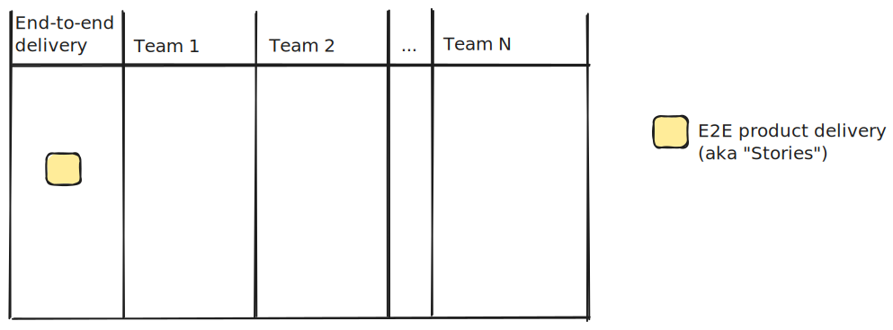
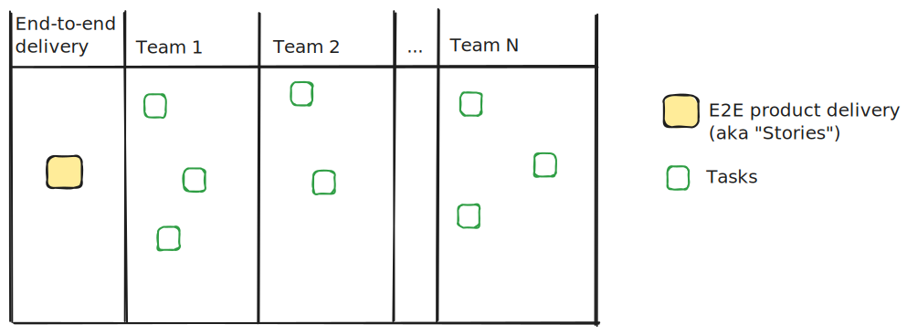
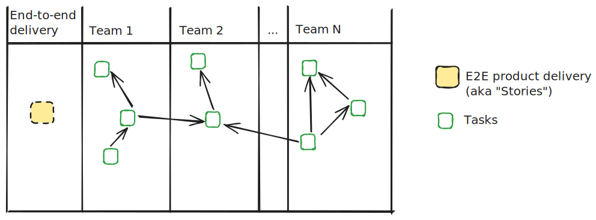
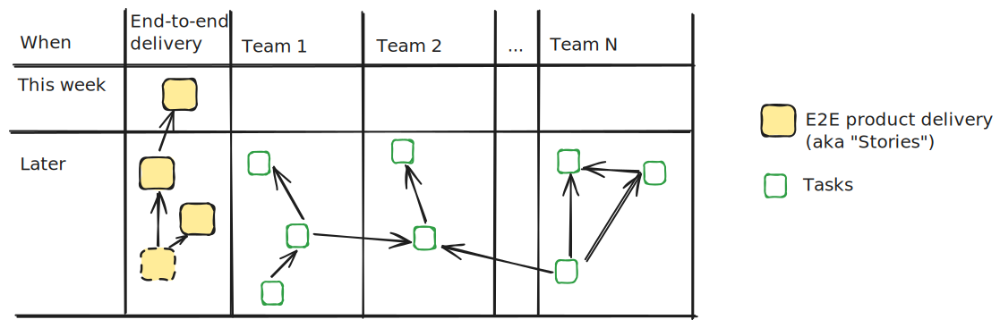
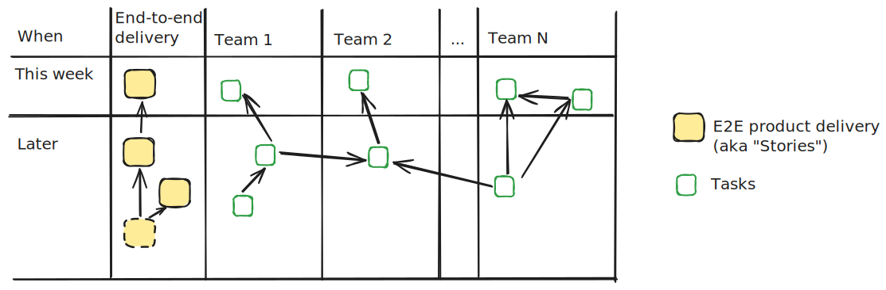
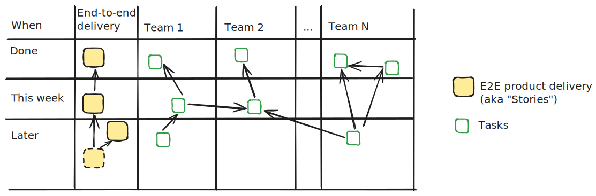

+++
date = 2024-10-29T10:31:35+02:00
title = "A large project, broken up"
description = "Agile done, in a sneaky way."
tags = []
slug = "large-project-breakup"
+++
Last year, I was on a multi-team project that was handed to us by our product organization. The project had lots of dependencies between teams and could have been a disaster. Today I would like to share how I helped to contribute to the project's success.

The project was to deliver a new product feature, and the deadline was three months in the future. About 15 engineers were involved in this project, and no product owner was included in the project group to guide us.

[miro]: https://miro.com

Our first week was a mess. It was somewhat unclear who was running the project, and worse, we lacked common ground on how to approach it. Someone proposed that we create (virtual) Post-it notes on our (online) whiteboard, one Post-it for every task needed to finish the project. Suddenly, the board was filled with many unstructured tasks. But how would we approach them?

As someone who has seen large-scale engineering efforts fail miserably, I was getting worried. I noticed that some people seemed contemptuous about their team's tasks. They signaled that now they knew exactly what they needed to build for the next 2,5 months and the teams would simply piece together things as we went along. Others, like me, were worried that we would end up with a failed waterfall project. Quick feedback on delivery was lacking, and were were [following a plan over responding to change][agile].

[agile]: https://agilemanifesto.org

## Breaking down the work

One good thing was that the group accepted my idea to have a meeting every Monday to talk about how the project was moving along. Quick feedback, ftw! The following Monday, I asked to lead the meeting. It was done out of frustration, but few knew, I suppose. :)

My first step was to draw up a table where I asked the group to summarize what we were trying to achieve at the end of the quarter. While this might seem obvious at first glance, you might be surprised by the different answers you get when there are 15 people involved! After some conversation, we agreed to a common statement. Our whiteboard now looked something like this:

I then continued and asked everyone to write down all the tasks they thought their team would need to finish to reach our goal. I knew we needed to break these down into smaller, incremental deliveries, but I also knew that there were forces that did not have an agile mindset. If we did not write down _everything_ that needed to be done, they would feel uncomfortable and not in control. We used a different color for tasks, and this is what the board looked like after this step:

"Wow, that's a lot of tasks!", I said smiling. "I think we need to add some structure to this. How about we add arrows between tasks that we know depend on each other? Let's also move, tasks needed to be done earlier higher up and tasks done later further down.". People nodded and once again engaged in the Miro board. The outcome looked something like this:

At this point, I suggested to build a really small end-to-end implementation by the end of the week. Something that we could show to product owners and managers[^1].

[^1]: I deliberately avoided the word "stakeholders" to sound less businessy, be more inclusive, and more concrete.

Multiple group members came up with a few different candidates for end-to-end implementations and we realized they actually had dependencies between themselves. Great! This naturally showed us which end-to-end delivery we would start with!

I made three changes to our whiteboard:

 1. Added all the end-to-end candidates with dependency lines to the left-most "End-to-end delivery" column.
 2. Split the table vertically into a crude chronological split: "This week" & "Later".
 3. Moved our top-pick end-to-end delivery into "This week".

Our whiteboard now looked like this:

In our final step for our planning session, we moved all the tasks related to our first end-to-end implementation up into "This week". This allowed everyone to see exactly the low-level tasks that needed to be implemented and how they depended on each other:

This visualization was particularly useful in identifying bottlenecks early. Which team would likely block other teams? Could we somehow support that team with more engineers, or have another team implement something?

Once we had the above whiteboard board ready, we spent the rest of the week implementing and collaborating. Teams were themselves responsible for creating actual Jira/Linear tickets for each task. And, as Friday approached, we had something to show.

Every Monday, we revisited our board, and

1. moved our done tasks and end-to-end deliveries up into "Done".
2. moved a new end-to-end delivery and corresponding tasks up into "This week".

It looked something like this:

I found the "Done" row to be a great way to also celebrate all the work we had done as our quarter progressed.

## Conclusion

I liked this approach of using a whiteboard over spending a lot of time in a ticketing system for planning. It was fun, pragmatic, and social. It also allowed us to visualize planning without overplanning.

Also, by facilitating, I helped our working group to collaboratively structure the work we needed to do. By breaking down the work into smaller, weekly, end-to-end deliverables, we ended up showing our stakeholders progress every week. We approached our project in an agile way, without me ever having to use the convoluted term "Agile". The project was delivered successfully - on time.
