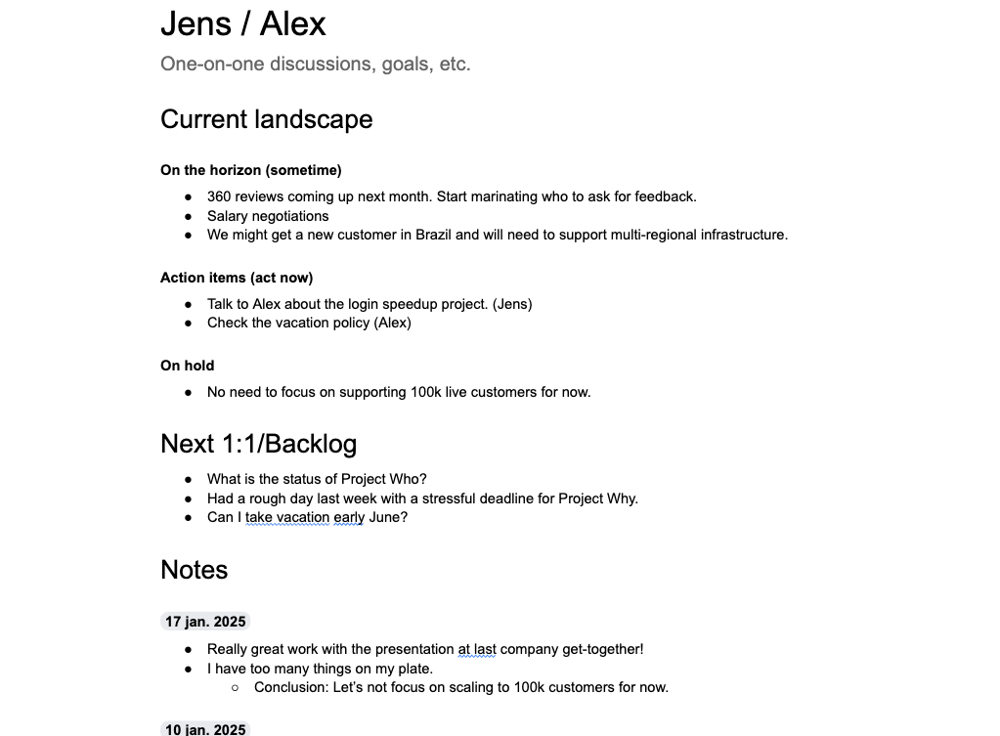

+++
date = 2025-01-16T18:16:35+02:00
title = "A one-on-one template"
description = "An agile template for regular 1-on-1 meetings."
tags = ["leadership", "management", "templates"]
slug = "one-on-one-template"
+++

I have used the same one-on-one template with my last six managers, including other regular check-ins. I am very happy with it! A recent conversation with a friend made me realize I better share the template with the world. If nothing else, I should share it for my own sake - in case I need it for another regular 1-on-1 setting sometime in the future.


**TLDR;** You can find the template [HERE][gdoc]. Feel free to use it by [making a copy of it][gcopy].

[gdoc]: https://docs.google.com/document/d/1Det7O1UQxIFgUywivldqTejmhyyeQ-YD1CNxXcGTPV0/edit?usp=sharing
[gcopy]: https://support.google.com/docs/thread/263397551?hl=en&msgid=263400451


## One-on-one?

A "one-on-one", also known as "1-on-1", "1:1", or a "check-in", is a private meeting between two individuals. While part of the template would make sense for a non-recurring one-on-one, you get the most value from it in recurring one-on-ones.

Also, one-on-ones are _not_ just between your manager. It can be regular meetings with anyone, such as skip-level meetings where you talk to your grand boss once in a while, or that regular meeting you have with your team's product manager.

At a very high level, I think of a one-on-one as a place and time to 1) sync on the current landscape and 2) decide how to act. As such, a one-on-one template should help with that.

## The template



The template document has three sections:

 * **Current landscape** describing the current state of things.
 * **Next 1:1/Backlog** containing a list of things that should be discussed in the next 1:1.
 * **Notes** containing brief notes from previous 1:1 of things that have been discussed.

In the best of worlds, the document is maintained _by both ends_ of the one-on-one. Anyone can add things to the "Next 1:1/Backlog" section. The same applies to bullet items under "Current landscape". If you are a manager, sometimes _you_ need to do something for your report, etc.

Let's go through the overall sections in more detail:

### Current landscape

"Current landscape" describes what the landscape of where we are heading looks like such as things we need to act on right now ("Action items"), things we foresee will happen soon ("On the horizon"), and things that we _don't_ need to focus on right now ("On hold").

If you are a manager, this section could also include a list of goals that a report would like to achieve by the end of the year, etc.

### Next 1:1/Backlog

This section contains bulleted talking points for the next 1:1. Whenever I have come up with a topic I would like to discuss with my one-on-one peer, I have been able to quickly open up the document and add a simple bullet item _at any time during the week_. Quick and easy.

Usually, a sentence has been enough. Occasionally, I have also pasted a screenshot or link. I have given the rest of the information during the actual meeting.

### Notes

Whenever a one-on-one meeting has started, I have added today's date under "Notes". For every talking point, we have moved it down to Notes. Additional notes have been added as sub-bullets for the talking point.

## One-on-one flow

Given the above structure of the template, every one-on-one I have had can be described using the following pseudo code:
```python
todays_date = new Date()
new_notes_section = add_a_new_headline_under_notes(todays_date)

while there_is_still_time_left_in_meeting():
  topic = pick_most_important_item_from_next_1:1_section()
  remove_from_next_1:1_section(topic)
  item = add_item_to_notes_section(new_notes_section)
  while item_is_being_discussed():
    add_notes_to_item(item)
```

## Implications of using this template

At my previous job, I switched managers five times in 2,5 years. :exploding_head: Whenever I switched manager, I could make a copy of the document, remove/redact things I was not willing to share with my new manager, and then share the new copy with my manager[^1]. I then asked my new manager to skim the notes section and sit down with me to discuss. This was a 

[^1]: Make sure to [remove the old version of the document from the version history][removeversion], though!

[removeversion]: https://www.groovypost.com/howto/delete-version-history-in-google-docs/


You can find the template [HERE][gdoc]. Feel free to use it by [making a copy of it][gcopy].

[gdoc]: https://docs.google.com/document/d/1Det7O1UQxIFgUywivldqTejmhyyeQ-YD1CNxXcGTPV0/edit?usp=sharing
[gcopy]: https://support.google.com/docs/thread/263397551?hl=en&msgid=263400451


PS. I _think_ credit for this initial template goes to my old manager [Fredrik Wallenius][freddew]. Thank you, Fredrik! :bow:

[freddew]: https://www.linkedin.com/in/fredrik-wallenius