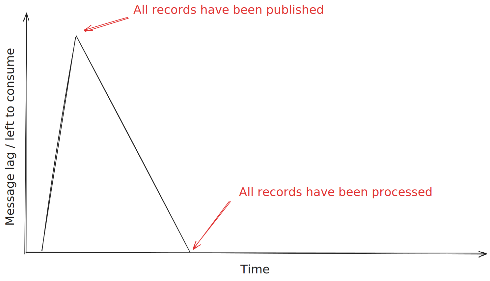
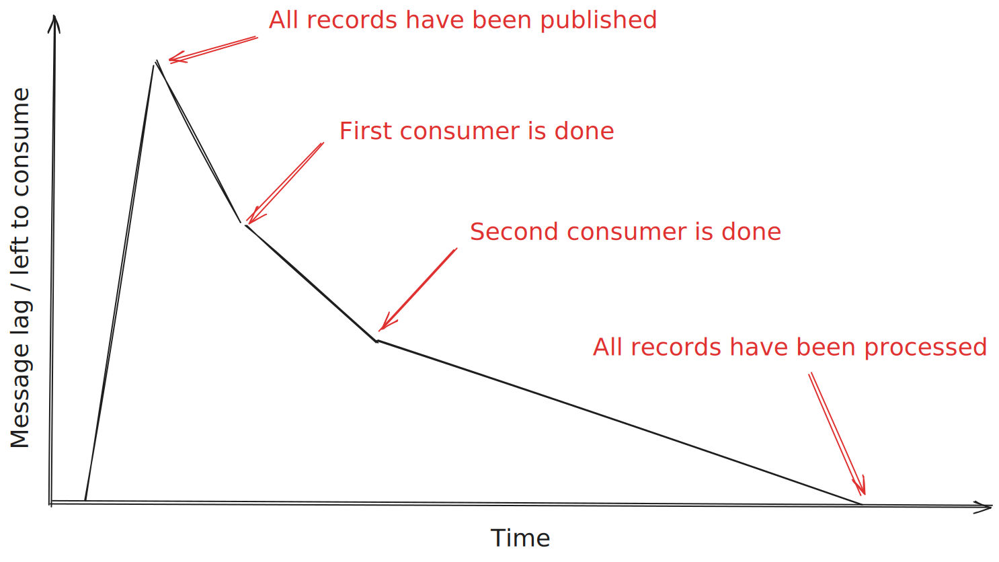
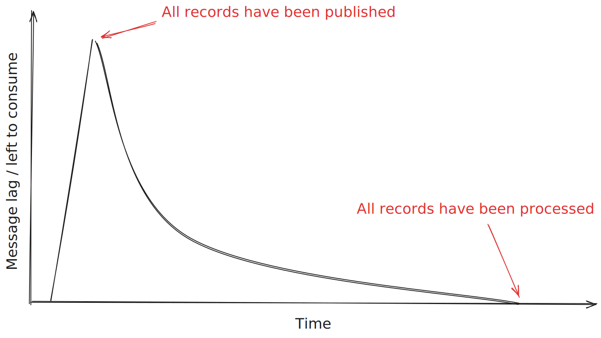

+++
date = 2025-09-05T18:44:35+02:00
title = "Apache Kafka and the costs of ordering"
description = "The implications of Apache Kafka being great at ordered consumption, means that it is horrible at load-balancing."
tags = ["Apache Kafka", "Distributed Systems"]
categories = ["Apache Kafka load-balancing"]
slug = "apache-kafka-load-balancing"
+++
In [my previous post][prev-post] I described Apache Kafka's (from now on, Kafka) high-level architecture and concepts. Today I will talk about one of the trade-offs with Kafka's architecture, namely _ordering_.

[prev-post]: 

Kafka uses _strict ordering_ which means that all messages will be consumed in the order that they were published to Kafka in. At first glance, strict order consumption might look exactly like what you want. As an engineer, strict ordering means that you don't need to think of receiving out-of-order messages in any way. However, ordering has a surprising number of costs, which the rest of this article will focus on.

To structure this article, I have decided to split it into two sections: The first section focuses on the design costs of having a FIFO partition design. The second section focuses on the issue of having multiple partitions within a topic.

## Single-partition issues

If you have read my [previous post][prev-post], you remember that a single Kafka topic's partition is a _log_. Each partition has a **single** consumer[^2], which consumes the records from its log **in the same order as the records were written**. That is, in a strict [FIFO][fifo] manner.

[fifo]: https://en.wikipedia.org/wiki/FIFO_(computing_and_electronics)

Google's Pub/Sub documentation used to have a great piece of documentation about ordering that I used to refer engineers to. Luckily, it can still be found through Internet Archive [here][google-ordering]. The article states:

[google-ordering]: https://web.archive.org/web/20190629192452/https://cloud.google.com/pubsub/docs/ordering

> "Even in this simple case, guaranteed ordering of messages would put severe constraints on throughput. The only way to truly guarantee order of messages would be for the message delivery service to deliver the messages one at a time to the subscriber, waiting to deliver the next message until the service knows the subscriber has received and processed the current message (generally via an acknowledgement sent from the subscriber to the service). Throughput of one message to the subscriber at a time is not scalable. The service could instead only guarantee that the first delivery of any message is in-order, allowing redelivery attempts to happen at any time. That would allow many messages to be sent to the subscriber at once. However, even if ordering constraints are relaxed in this way, “order” makes less sense as you move away from the single publisher/message delivery service/subscriber case."[^1]

[^1]: It's worth pointing out that Google's Pub/Sub product [now supports FIFO consumption][pubsub-ordering], similar to [SQS FIFO][sqs-fifo].

[pubsub-ordering]: https://cloud.google.com/pubsub/docs/ordering
[sqs-fifo]: https://docs.aws.amazon.com/AWSSimpleQueueService/latest/SQSDeveloperGuide/sqs-fifo-queues.html

I think that paragraph is key. I will discuss some of those issues below. However, I will start with the most common fallacy of strict ordering:

### Full system strict ordering

When people talk about strict ordering with Apache Kafka, we tend to focus on the consumer end of the flow. We assume that a record was written successfully to Kafka. However, it's important to look at strict ordering from the perspective of the _whole_ system, not just the consuming side.

As [the Fallacies of Distributed Computing][dist-fallacies] states, _the network is not reliable_. If the network had a glitch, a record might not have been successfully written to Kafka. We dropped the record. Poff. If we want strict ordering of records and [resilient][resilience] delivery of records to Kafka, we must of course have some kind of [retry with backoff][exp-backoff]. This begs the question, **should we allow other records to be written to Kafka, while we retry our dropped message?** If strict ordering is required, we must never send those before our dropped message, right?

If we want strict ordering on the producing side, we need to buffer older messages in the client and only make sure to send those when our dropped/failed record gets delivered. Buffering is not rocket science, but it can have detrimental effects if we run out of memory.

But buffering does not solve all cases of unordered writes to a partition. Nothing is stopping two different producing clients from writing to the _same_ partitions. To alleviate this, you usually need to employ some kind of routing of records to the same partition is being routed through the same producing client.

Turtles all the way down.

[dist-fallacies]: https://en.wikipedia.org/wiki/Fallacies_of_distributed_computing
[resilience]: 
[exp-backoff]: https://en.wikipedia.org/wiki/Exponential_backoff

I do not think more people think about this strict ordering on the producing side. It can have surprising side effects if you don't consider this, and solving this can lead to a lot of unwanted complexity.

[sqs-dedupe]: https://docs.aws.amazon.com/AWSSimpleQueueService/latest/SQSDeveloperGuide/using-messagededuplicationid-property.html

### Throughput

[The Google article about ordering][google-ordering] I referred to above talked about the throughput limitations of strict ordering. Since strict ordering requires consuming records (of a partition) in the exact order as they were written, it means that you can't have multiple consumers[^2] helping out. This puts an upper limit on the number of messages that can be consumed per partition.

[^2]: ...for the same consumer group.

In theory, this is not a problem as you can always add more partitions to a Kafka topic. However, in practice:

 * Adding partitions to a live topic will break strict ordering.
 * Adding partitions can't be done dynamically if you have a peak in traffic.

This means you always need to overprovision the number of partitions. However, [more partitions may increase unavailability][more-part-more-unavail]. :shrug:

[more-part-more-unavail]: https://www.confluent.io/blog/how-choose-number-topics-partitions-kafka-cluster/

### Poison pills

Another problem with the strict delivery is in the event of a ["poison pill" record][poison-pill]. It is a record that always fails to be consumed. There can be two reasons for this happening:

[poison-pill]: https://en.wikipedia.org/wiki/Poison_message

 * **A permanent issue.** For example, maybe the JSON payload is corrupt, or the user loaded from the database was corrupt.
 * **An intermittent issue.** For example, a temporary problem connecting to a database or cache.

The problem is that it is very hard to distinguish between these two in code; For that, you would need to go through all error cases, which is [impossible to do][resilience-list].

[resilience-list]: 

Assume, we need to handle these two error cases the same way. What can we do? We can retry as described earlier, but that has the risk of blocking all newer records from being delivered if there is a permanent issue consuming the record.

Another common approach for poison pill messages in message passing systems is to store them in a "dead letter" topic. Maybe you retry the message three times, and if it doesn't succeed in getting handled, you put it in another topic. The problem with this is that **you, by definition, break ordering with a dead letter topic** since you will then start to consume newer messages without having consumed an older one!

## Multi-partition issues

As stated in my [previous post][prev-post], each record gets written to a specific partition. Which partition a record is routed to is decided by the client submitting the record ("the producer"). Usually, it's round-robin or based on the record's key. There are five common cases which can lead to an uneven distribution of messages between the partitions:

 * Different consumers have different throughput.
 * High variance in processing latency in consumers. For example, when processing a record takes between 50ms and 10 seconds.
 * A badly chosen record's key, such that records are not evenly distributed among the partitions.
 * Bad luck -- you are using round-robin partitioning, but the randomizer distributes the records unevenly. This happens more likely with fewer partitions and/or fewer messages.
 * The number of partitions assigned to each broker varies.

If there is any big takeaway you should have from this post it is that **Kafka does not do *any* kind of rebalancing of records between partitions once they have been written** and **it's pretty likely that there will be partition imbalances**. There are some [workarounds to even out your data distribution][high-traffic], but I would not generally recommend going down that route.

### An example

Let's assume that you produce a big batch of records and consume at the highest rate possible. This is what your backlog of number of messages to consume will look like:

In reality, consumption there is almost partition imbalances. For a three-partition Kafka cluster, you will likely see a graph similar to this:

Notice how it will take _significantly_ more time to process all messages than the first graph. For a cluster with more partitions and brokers, you likely see something like this:

At some point in the future, I might build a small tool to simulate this graph. But that most important insight is that **Kafka will not use your resources as effectively as it can, by design**.

### Rebalancing issues

The fact that no rebalancing happens can lead to a lot of issues down the road:

 * Horizontal elastic auto scaling of consumers will not really work
 * Overprovisioning of disk space
 * Consumer overprovisioning

I'll deal with them one at a time:

#### Elastic horizontal scaling issues

#### Disk overprovisioning

A common trait you want in a 

A bad key can lead to more brokers using more disk space.

#### Consumer over provisioning

TODO: Distinguish between task queue and log.

## Conclusion

Kafka is really great if you have a low-variance latency consumption. For high-variance, you quickly run into issues around consumer load-balancing.

## Further reading

 * The article ["Solving Uneven Load Distribution Problem for High Traffic System"][high-traffic] talks about various solutions you could employ to avoid uneven load. All of these solutions assume that you are not doing partition routing in your client.

[high-traffic]: https://dip-mazumder.medium.com/solving-uneven-load-distribution-problem-for-high-traffic-system-1d23ddbf7113
