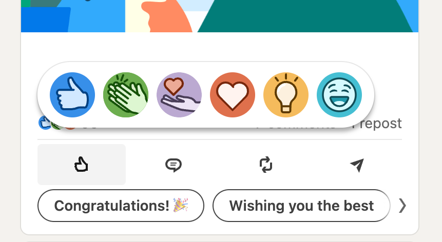

+++
date = 2025-09-05T14:30:35+02:00
title = "LinkedIn and Toxic Positivity"
description = "LinkedIn is a social network of toxic positivity."
tags = ["LinkedIn"]
slug = "linked-and-toxic-positivity"
+++
> **Toxic positivity** (excessive positivity or positive toxicity) is dysfunctional emotional management without the full acknowledgment of negative emotions [...]
>
> ([Wikipedia][wiki])

I rarely rant on this blog. But for a change, now is the time!

[wiki]: https://en.wikipedia.org/wiki/Toxic_positivity

In Swedish, there is the expression "Axelklapparklubben" which litterally translates to "The Back-patting club". It's a mutual admiration society, an expression that is used to describe a setting where every participant is only telling each other how great they are.

Every time I go on [LinkedIn][linkedin], this is the feeling I get -- a place where everyone mostly are cheering about new jobs, new projects delivered, and promotions. I see comments like "Congratulations!", "Great work!", "Good luck!", and "You are the best!!! Keep on rockin'!!1!!!11!".

[linkedin]: https://www.linkedin.com

Don't get me wrong, I _love_ micro celebrations. But there are diminishing returns. And to be frank, the information density in the "yays" & high fives" is not that high. If the largest global community of business professionals only are celebrating progress, I think we are wasting everyone's time.

I don't think LinkedIn necessarily should turn into a hate-speech corner of the Internet (ahem, X & Truth Social), but I would love to see LiknedIn having more complex conversations, where there are no right or wrong. Where are the posts about company ethics? Or why certain companies find it hard to reach net-zero climate emissions? What are your struggles? Where are the learnings from failure? Why not discuss how you were let go?

LinkedIn's UI does not help with any of this. Every single emoji reaction is positive, and the above screenshot also shows that all proposed responses are positive.

I am tired of LinkedIn's toxic positivity. The industry I am in forces me to use LinkedIn. Sometimes I just wish I didn't have to.
