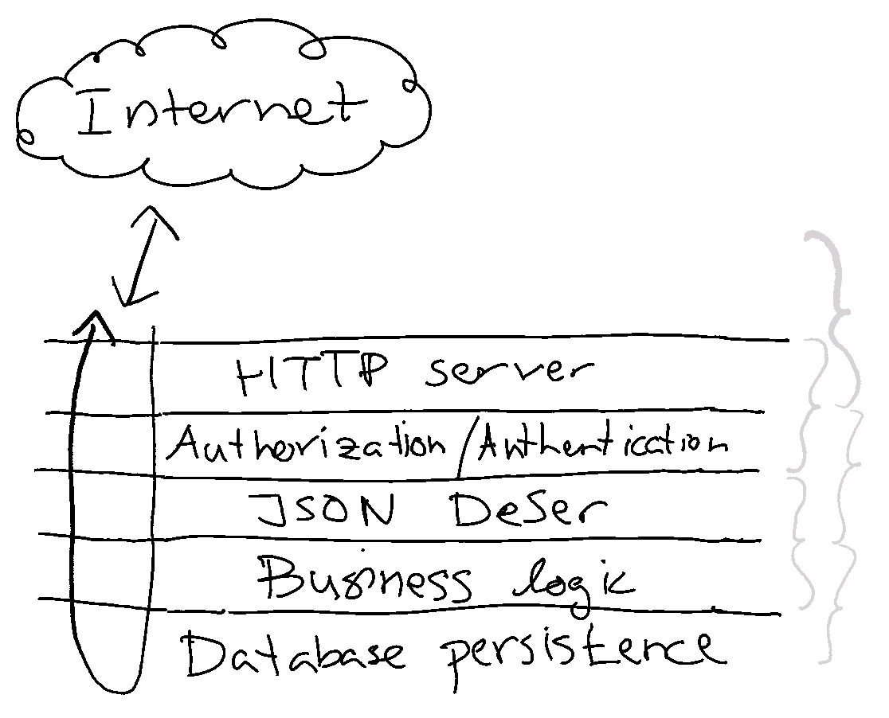

_Narrow integration tests_ are tests that only involve very few components,
mostly relying on [test
doubles](https://martinfowler.com/articles/mocksArentStubs.html) to simulate
external dependencies. As always, we have Martin Fowler to thank for yet
another excellent
[article](https://martinfowler.com/bliki/IntegrationTest.html) on integration
tests so I'll simply refer to that for the details of what a narrow integration
test is.

That said, during 2019 I have grown increasingly convinced that the distinction
between a narrow and wide integration is an important one, for two reasons:

First, given that narrow integration tests depends on very few components the
[cost of maintenance is very low](). Compare this to wide integration tests where cost of maintaining them
increases with number of components and/or software complexity.

Secondly, because I believe a large majority of the wide integration tests can
be replaced by a set of narrow integration tests. The benefit would be a more
maintainable test suite over time, with equal confidence that it catches bugs.
Let me explain:

A common counter-argument against unit and narrow integration testing is that
they don't test the application as a whole. In one way, this is true, but you
could also look at _a whole as an overlap of many smaller pieces_. For example,
a lot of software architecture models involves thinking in layers ([Hexagonal
architecture](https://en.wikipedia.org/wiki/Hexagonal_architecture_(software)),
[Clean
architecture](https://blog.cleancoder.com/uncle-bob/2012/08/13/the-clean-architecture.html)
and more). So, let's imagine a very simple application that receives an HTTP
API call, does some business logic and stores something in a database:

An API call from the Internet flows through each layer of our application. With
input being validated and transformed as it passes through layers towards
persistence, and result/output from the final persistence eventually trickling
back to the API caller.

A growing hypothesis of mine is that *it's very unlikely that bugs are
introduced by miscommunication between non-adjacent layers*. This means, that
as long you have made sure to test each layer boundary, you should in be pretty
confident that the application works as a whole. For example, in the image
above, you can see that all the curly braces to the right are overlapping. Each
curly brace is a set of narrow integration tests.

Could there be bugs that are introduced by pairs on non-adjacent layers? Yes,
but like I said very unlikely. Ignoring when you've actually missed a narrow
integration test case, you _might_ see issues such as

 * application using too much resources (CPU, memory, I/O...) when all
   components are put together.
 * low-level concurrency-related issues.
 * memory corruption bugs.

These days, bugs like these are pretty uncommon. My recommendation is that you
focus on implementing those narrow integration tests first if you can.
